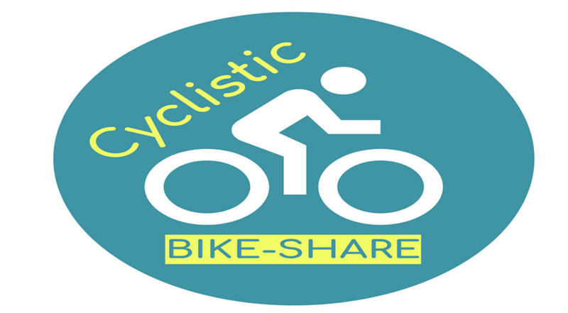
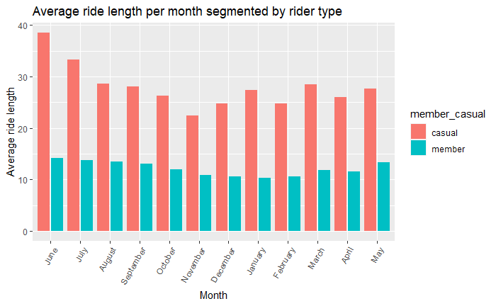
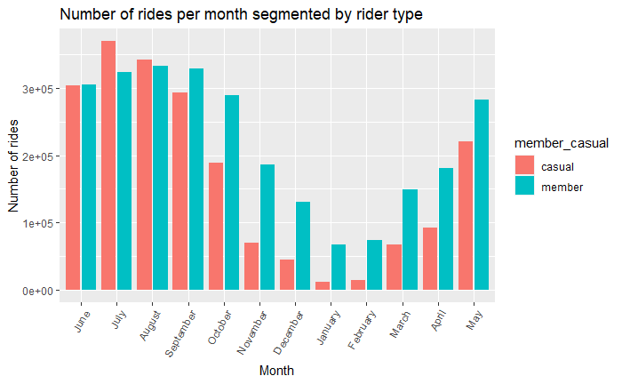
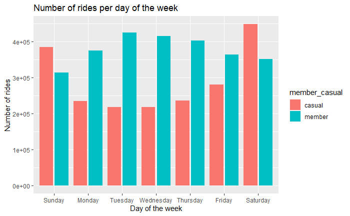
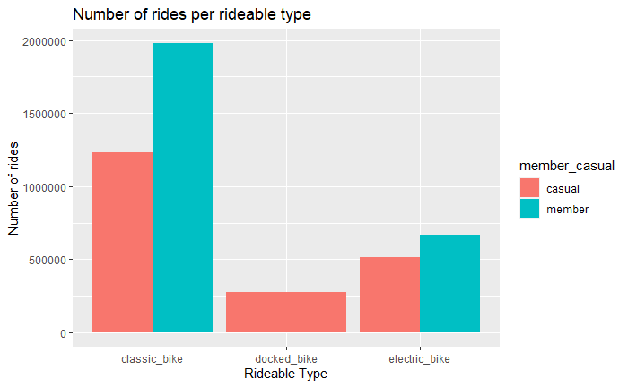
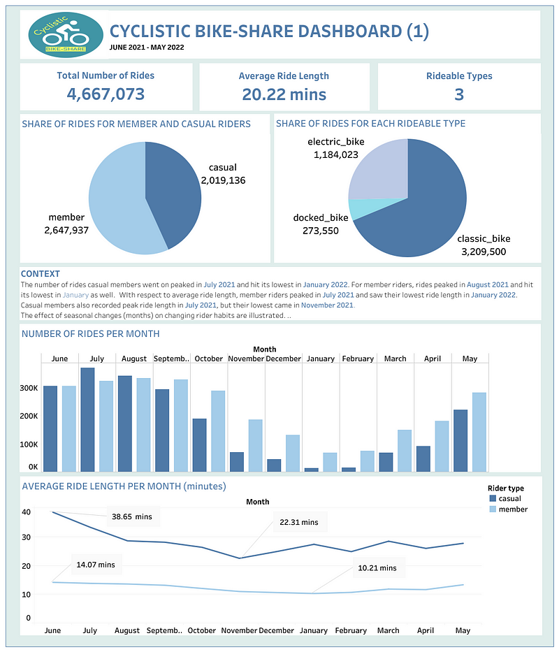
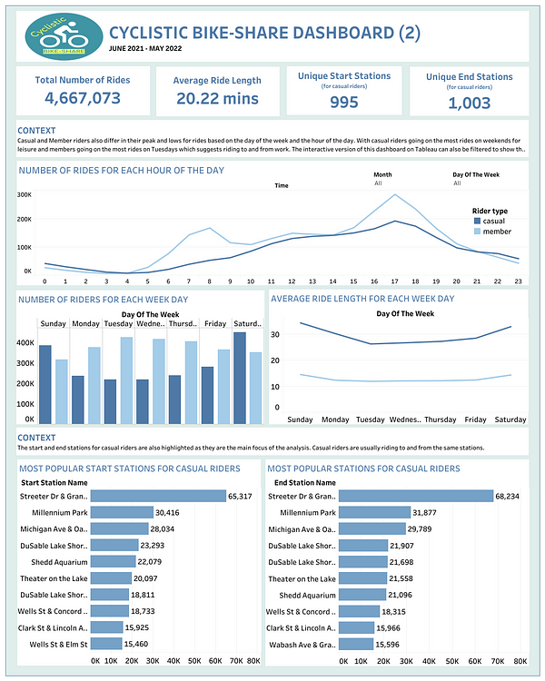

# Google Data Analytics Capstone Project: Cyclistic Bikeshare Case Study

The Cyclistic bike-share capstone project is the final course of the Google Data Analytics certificate that I recently concluded. In this project I have applied the tools I acquired over the course of the study- including R, Tableau and PowerPoint- to solve a real world scenario.

## Table of Contents

- About the Company
- Introduction and Scenario
- Asking Relevant QUestions
- Preparing the Data
- Analyzing the Data
- Sharing Findings
- Act
- Conlusion

## About the Company

Cyclistic is a successful bike-sharing company with a fleet of 5,824 bicycles that are geotracked and locked into a network of 692 stations in Chicago. Cyclistic’s marketing strategy has previously relied on building general awareness and appealing to broad consumer segments. Such as though the flexibility of its pricing plans: single-ride passes, full-day passes, and annual memberships. Customers who purchase single-ride or full-day passes are referred to as casual riders. Customers who purchase annual memberships are Cyclistic members. Cyclistic’s finance analysts have concluded that annual members are much more profitable than casual riders. Although the pricing flexibility helps Cyclistic attract more customers, Moreno believes that maximizing the number of annual members will be key to future growth. Rather than creating a marketing campaign that targets all-new customers, Moreno believes there is a very good chance to convert casual riders into members. She notes that casual riders are already aware of the Cyclistic program and have chosen Cyclistic for their mobility needs.

## Introduction and Scenario

“You are a junior data analyst working in the marketing analyst team at Cyclistic. The director of marketing believes the company’s future success depends on maximizing the number of annual memberships. Therefore, your team wants to understand how casual riders and annual members use Cyclistic bikes differently. From these insights, your team will design a new marketing strategy to convert casual riders into annual members. But first, Cyclistic executives must approve your recommendations, so they must be backed up with compelling data insights and professional data visualizations.”

This project will follow the steps of the data analysis process: 
- Ask
- Prepare
- Process
- Analyze
- Share
- Act.

## Ask

This phase involves defining the issue to be solved, identifying stakeholders and what their expectations from the project are.

Three questions will guide the future marketing program:

1. How do annual members and casual riders use Cyclistic bikes differently?
2. Why would casual riders buy Cyclistic annual memberships?
3. How can Cyclistic use digital media to influence casual riders to become members?

### Business Task

The task assigned to the junior analyst is to figure out how annual members and casual riders use Cyclistic bikes differently.

### Key Stakeholders

Lily Moreno: The director of marketing and your manager. Moreno is responsible for the development of campaigns and initiatives to promote the bike-share program. These may include email, social media, and other channels.

Cyclistic marketing analytics team: A team of data analysts who are responsible for collecting, analyzing, and reporting data that helps guide Cyclistic marketing strategy.

Cyclistic executive team: The notoriously detail-oriented executive team will decide whether to approve the recommended marketing program.

## Prepare

Involves collecting data and information and ensuring it satisfies necessary parameters.

### Data location, licensing and privacy

The data has been made available by Motivate International Inc. at this [link](https://medium.com/r/?url=https%3A%2F%2Fdivvy-tripdata.s3.amazonaws.com%2Findex.html) under this [license](https://medium.com/r/?url=https%3A%2F%2Fride.divvybikes.com%2Fdata-license-agreement). For privacy purposes riders personally identifiable information has been excluded from the data.

### Data Organization

The data used for this analysis is the past 12 months from June 2021 to May 2022. Each month contains hundreds of thousands of rows and 13 columns.

### Bias and Credibility

The data satisfies the ROCCC standard which means that it is reliable, original, comprehensive, current and cited.

### Data Limitations

The dataset contains some null values that were deleted and hence not used in the analysis.

## Process

This phase of the analysis process includes cleaning the data and making sure it is fit for purpose. As well as making any modifications necessary.

Rstudio was used for the data processing phase of this project. Click this [link](http://rpubs.com/TemiAbdullah/927011) to view the full R markdown file. A summary of the cleaning and manipulation done to the data is presented below:

1. Combined all twelve individual months into a single data frame called "Combined_Trips".
2. Created new columns to extract the day, month, year and day of the week of each ride entry.
3. Created a new column calculating the length of each ride from the difference between the recorded "end_time" and "start_time" of each ride entry.
4. Changed the "ride_length" from time datatype to numeric datatype.
5. Deleted all the rows in the data frame with a null entry.
6. Deleted entries with ride length less than zero.
7. Created a new data frame that did not include the longitude and latitude columns as they were not needed for the following analysis.
8. Created a new data frame where the "started_at" and "ended_at" locations were combined to get an aggregate route of each ride/trip.
9. Ordered the months from June 2021 to May 2022 and the days of the week from Sunday to Saturday.

## Analyze

Analyzing the data to find patterns, relationships and trends.

Rstudio was used for the data analysis phase of this project. Click this [link]( http://rpubs.com/TemiAbdullah/927011). A summary of the insights gleaned from the data analysis is presented below:

1. There were six hundred thousand more recorded rides by member riders over casual riders. But the casual riders spent more than two times as many minutes in their rides than the member riders. Casual riders also experienced a maximum average ride length much higher than than that of the member riders per month.

2. Casual riders experienced a peak in July while member riders experienced theirs in August. Both riders also experienced a year low in January.

3. Casual riders went on the most rides on Saturdays whilst member riders went on the the most rides on Tuesday.

4. The most common rideable type in the recorded period was the classic bike. Both rider types recorded the most rides with the classic bike. However, the member riders did not make use of the docked bikes at all.

 

## SHARE

Findings are shared and communicated to the relevant stakeholders.

The share phase for this project was completed using Rstudio and Tableau for visualizations. Microsoft PowerPoint was also used to prepare a presentation of the findings.

Click [here](https://public.tableau.com/views/CyclisticProjectinprogress/Shareofridesformembersandcasualriders?:language=en-US&:display_count=n&:origin=viz_share_link) for tableau public visualizations. Dashboards created with the visualizations also present relevant information at a glance. 

The first dashboard displays summary information about the data presented for the analysis. Such as the number of rides, average ride length and so on. 
                      

A second dashboard was also created to provide more in depth information about the riding habits of the casual and member riders. 

Click [here](https://1drv.ms/p/s!AgXANZPWFO1_gmgjkT644_gGZ2YK) for the Powerpoint Presentation. 

## Act

After the data has been processed, analyzed and insights have been shared, the final phase is to recommend a plan of action for the bikeshare company in line with their business task and objectives. My recommendations are:
1. Cyclistic already has single ride and full day passes, but it could be worth it to introduce a new monthly/seasonal plan for riders. The data shows that the number of rides casual riders go on is greatly affected by the season or the weather. Many rides in the summer from June to September and very few rides in the winter from November to February. Cyclistic can offer free membership for a full month to any casual riders that are interested in the service. It would be best to do this in the winter months where riders don't use the service as much. If they enjoy the perks of a full membership in these months or seasons, it could convince them to subscribe for more months and ultimately purchase a full annual membership.
2. Another way to convert casual riders into full time members could be targeted physical ads and campaigns. The data extracted from the past 12 months gives us insight into the most frequently used start and end stations used by casual riders as well as the routes they use on their rides. Billboards and posters are a lot more useful if the company already knows exactly where the target audience will be.
3. Cylistic can provide financial incentives for member riders and start a campaign that shows how subscribing for a full year is cheaper in the long run than subscribing only for the days in the summer months like casual riders usually do. They could also provide coupons or bonuses that encourage even more frequent rides. An example of one such incentive could be a weekly scoreboard showing the number of rides and ride length for each casual rider that chooses to participate with the winner at the end of the month getting a seasonal pass or annual membership as a reward. If casual riders can be convinced to take the bike out more frequently every week, they will ultimately see the benefit in simply subscribing to a full plan that allows them use it whenever they like.

## Conclusion

Over the course of this project, I have been able to demonstrate my ability as a data analyst by using a variety of tools to clean, process, analyze and visualize data, as well as draw meaningful insights from it in line with the requirments Google Data Analytics Certification.
Feedback on this article and the processes used would be greatly appreciated.

